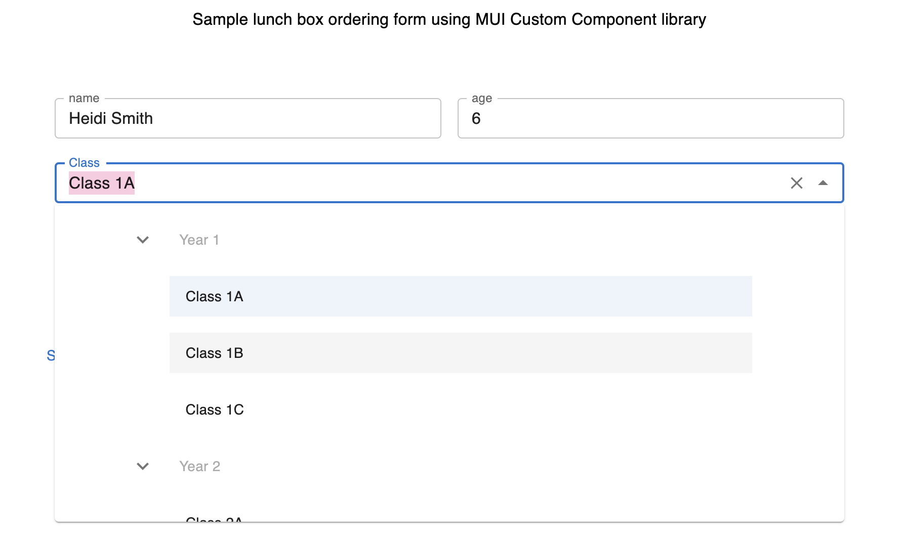

## MUI Custom UI Components

> 💡Highlight: Customized Tree Select component made with MUI's Autocomplete & List components



### Description

A set of customized MUI components designed to reduce redundancy & improve readability during frontend development using
React.js and MUI. Can be easily
used along with react-hook-form.

### Installation

```
npm i @lulutheflaneur/mui-custom-components
```

### Usage

```
import { TreeSelectMui } from "@lulutheflaneur/mui-custom-components";

import { useState } from "react";

function App() {

    const optionTree = [
        {
            children_data: [{code: '1a', level: 2, nodeLabel: 'Class 1A'},
                {code: '1b', level: 2, nodeLabel: 'Class 1B'},
                {code: '1c', level: 2, nodeLabel: 'Class 1C'}],
            code: 'p1',
            disabled: true,
            level: 1,
            nodeLabel: 'Year 1'
        },
        {
            children_data: [{code: '2a', level: 2, nodeLabel: 'Class 2A'},
                {code: '2b', level: 2, nodeLabel: 'Class 2B'},
                {code: '2c', level: 2, nodeLabel: 'Class 2C'}],
            code: 'p2',
            disabled: true,
            level: 1,
            nodeLabel: 'Year 2'
        }
    ]

    const [schoolClass, setSchoolClass] = useState('')

    const setValue = (_, classId) => {
        setSchoolClass(classId);
    };

    return (
        <TreeSelectMui
            defaultExpandAll
            label="Class"
            labelKey="nodeLabel"
            name="schoolClass"
            nestedTree={optionTree}
            valueKey="code"
            setValue={setValue}
            uniqueKey="code"
        />
    )
    
}
```

### Options in TreeSelect

`defaultExpandAll`: `boolean`, if all options in `nestedTree` are expanded and arrow is pointing down instead of
pointing right  
`defaultSelected`: `any`, set a default selected value on first sight, must be one of the `valueKey` values
in `nestedTree`  
`error`: `boolean`, whether there is an error in the field. Border turns red if true.  
`helperText`: `string`, the error message to be displayed  
`initialLevel`: `number`, the number `nestedTree` will look for as base level  
`InputLabelProps`: `Partial<InputLabelProps>`, MUI InputLabelProps config for TextField component  
`label`: `string`, label for MUI TextField  
`labelKey`: `string`, index key of `nestedTree` as AutoComplete Chip label  
`name`: `string`, name attribute for an `<input>` element  
`nestedTree`: `INestedTree[]`, an array of object options, must have `children_data` (any[]), `level` and any custom
key-value pair in every option.  
`valueKey`: `string`, index key of `nestedTree` as value. This value will be saved by `setValue` if selected  
`setValue`: `function`, can be for controlled / uncontrolled component  
`uniqueKey`: `string`, index key of `nestedTree` to index ListItem

### Story behind...

I was migrating a React.js, antd-based project to MUI. TreeView API is available in MUI but it seems impossible to be
used with Select / AutoComplete components for UI consistency. So, I tried writing a TreeSelect using MUI AutoComplete
and List components during my leisure time. ;)

### Components

- ButtonMui
- CheckboxMui
- DataGridMui
- FileUploadMui
- InputMui
- ModalMui
- RowMui
- SelectMui
- SnackbarMui
- SpanMui
- SwitchMui
- TextareaAutosizeMui
- TreeSelectMui
